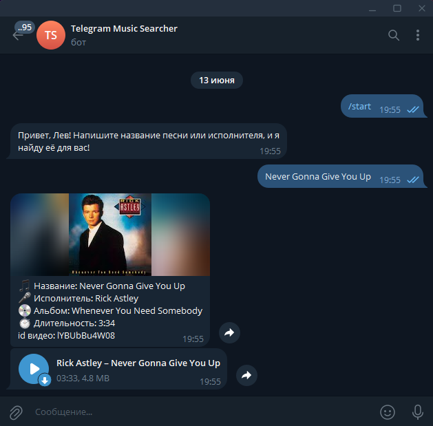

# Telegram Music Searcher

Музыкальный бот для Telegram, основанный на youtube music, который позволяет искать и скачивать музыку прямо в чате без необходимости покидать мессенджер.

## Скришноты 📸


## Основные возможности 🫠

- 🔍 Поиск музыки по названию или исполнителю
- 🎵 Прослушивание треков в телеграм

## Установка ⬆️

1. Клонируйте репозиторий:
```bash
git clone https://github.com/Levletsplay0/telegram-music-searcher.git
cd telegram-music-searcher
```

2. Установите зависимости:
```bash
pip install -r requirements.txt
```

3. Создайте файл `.env` с вашим токеном:
```
BOT_TOKEN=your_bot_token_here
```

4. Запустите бота:
```bash
python main.py
```

## Использование 🎧

1. 🔎 Найдите бота в Telegram
2. ▶️ Нажмите `/start` для начала
3. ✍️ Напишите название трека
4. ⏳ Подождите и слушайте музыку 🎉

## Технологический стек 🛠️

- 🐍 Python 3.12.3
- 🤖 [telebot (pyTelegramBotAPI)](https://pypi.org/project/pyTelegramBotAPI/)
- 🎵 [ytmusicapi (Поиск информации по треку)](https://pypi.org/project/ytmusicapi/)
- ⬆️ [yt_dlp (Скачивание трека с ютуба)](https://pypi.org/project/yt-dlp/)
